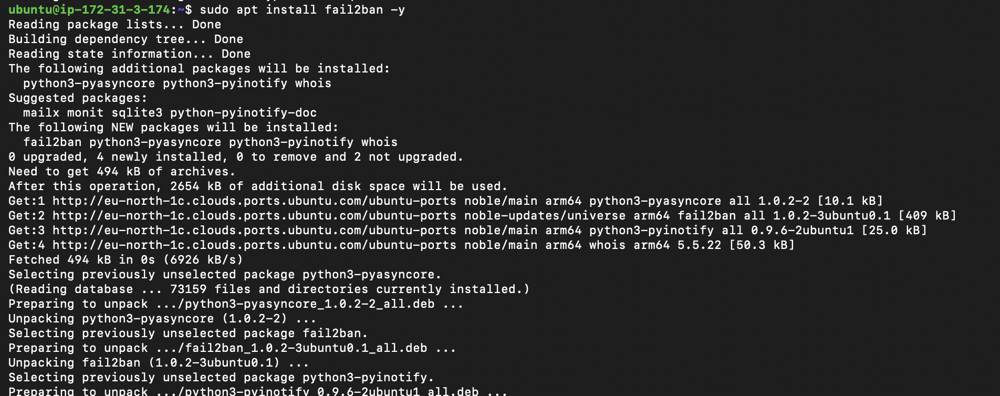

# Cloud infrastructure hardening: secure baseline deployment
**Status:** Completed | **Environment:** AWS | **OS:** Ubuntu 24.04 LTS (ARM64)

## Project brief
The goal of this project was to set-up (or provision) a modern, cloud-native Linux environment and implement a "Defense-in-Depth" security posture. This exercise aims to demonstrates the acquired knowledge in transitioning from a default cloud instance to a hardened production ready baseline.

### 1. Identity & cryptography
* **IAM Isolation:** Restricted IAM Administrator account execution following the Principle of Least Privilege.
* **SSH Keys:** Used the Edwards-curve Digital Signature Algorithm **ED25519** for higher security and better performance on the ARM64 architecture when compared to RSA.

### 2. Perimeter hardening (Network Layer)
**Stateful Firewall (AWS Security Group):**
  * **Default Policy:** Deny All Inbound.
  * **Whitelisting:** Restricted SSH (TCP Port 22) incoming strictly to my administrative Public IP.
  * **IMDSv2 Enforced:** Required Session based metadata service tokens to prevent Server Side Request Forgery (SSRF) attacks.

### 3. Host-based hardening (OS Layer)
**Vulnerability Management:** Conducted a full system patch cycle (`apt update && apt upgrade`) to remediate known CVEs in the base image.
**Intrusion Prevention (Fail2Ban):** Deployed Fail2Ban to monitor authentication logs. Configured it to automatically ban IP addresses exhibiting brute force patterns.
**Internal Shield (UFW):** Enabled the Uncomplicated Firewall with a "Deny-by-Default" stance, allowing only established SSH connections.

## Commands executed
```bash
# System Update & Patching
sudo apt update && sudo apt upgrade -y

# Intrusion Prevention Setup 
sudo apt install fail2ban -y



# Firewall Configuration 
sudo ufw allow 22/tcp
sudo ufw enable


```

## Gap analysis & future improvements not addressed in this exercise
While this exercise aimed to stablish a secure baseline, the following enhancements would be required for a production grade environment:
1. **Automated Scanning:** Integrate **Nmap** or **Amazon Inspector** to programmatically verify the 'Default Deny' network posture and scan for CVEs that may arise post deployment.
2. **Centralized Logging (SIEM Integration):** Export `auth.log` and `fail2ban` logs to **AWS CloudWatch** or a centralized SIEM platform, to ensure audit trail integrity and prevent attackers from cleaning their tracks by tampering with local logs.
3. **Zero-Trust Access (EC2 Instance Connect Endpoint):** Replace static IP whitelisting with **EC2 Instance Connect Endpoint**. This move will allow  to access servers in a private subnet with zero public internet exposure,  shifting the security focus from location-based access ('somewhere I am') to identity-based access ('someone I am').
