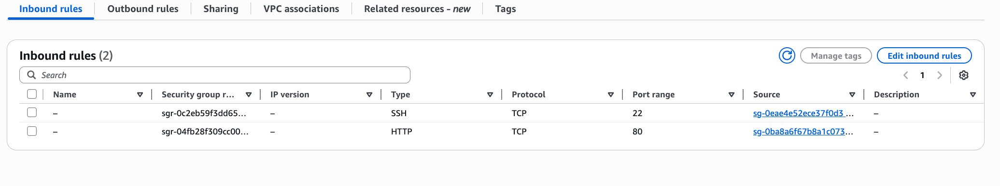

# VPC network segmentation

## Project brief
The goal of this project was to implement a secure, multi-tier AWS network architecture. In doing so, I want to demonstrate **Defense in Depth** practices by isolating application logic from the public internet using custom VPC subnets, NAT Gateways, and Security Group referencing. This setup ensures that even if one part is compromised, the rest of the network stays protected.

## Architecture design
The infrastructure was built inside a custom VPC (`10.0.0.0/16`) to ensure a completely isolated environment.

### 1. Public web tier
- **Subnet:** `10.0.1.0/24` (Public)
- **Component:** `public-web-01` (EC2)
- **Role:** To handle inbound traffic from the Internet Gateway.

### 2. Private app tier
- **Subnet:** `10.0.2.0/24` (Private)
- **Component:** `app-server-01` (EC2)
- **Role:** To process business logic. It has **no Public IP** and uses a **NAT Gateway** for outbound only traffic (updates/patches).

### 3. Private database tier (Data)
- **Subnet:** `10.0.3.0/24` (Strictly private)
- **Component:** Simulated database instance / RDS (architecture placeholder: Security Group Defined)
- **Role:** To store sensitive data. It has no route to the internet and **no NAT Gateway access**. It is the most isolated layer of the architecture.

---

## Security controls & validation

### 1. Lateral movement mitigation
A security test conducted was that a breach of the public tier would not allow an attacker to reach the private tiers.
- **Action:** Attempted `ping` from `public-web-01` to `app-server-01`.
- **Result:** **100% Packet Loss.**
- **Security Logic:** Showed that the "Default Deny" firewall posture prevented the discovery of internal assets.

### 2. Security group referencing
Instead of using IP-based rules, I have implemented **Security Group Referencing** to ensure traffic only flows through authorized ports:

| Connection | Protocol | Authorization |
| :--- | :--- | :--- |
| **Internet → Web** | HTTP/80 | Allowed for all (`0.0.0.0/0`) |
| **Web → App** | HTTP/80 | **ONLY** if source is `public-web-sg` |
| **App → Database** | SQL/3306 | **ONLY** if source is `app-tier-sg` |

### 3. Management via EC2 instance connect endpoint (EICE)
I used an **EC2 Instance Connect Endpoint (EICE)** to log into my private servers, instead of using a **Jump Server** because there was no need of public facing server or open SSH ports. I just used my AWS login to get in.

---

## Core Learnings
* **Isolation is key:** By removing the database tier's route to the NAT gateway, I ensured that sensitive data could not be "exfiltrated" to an external server, even if the DB code was compromised.
* **Stateful Filtering:** I've experienced **Stateful** security groups. When a request in is allowed, the response is automatically allowed back out, which simplifies firewall management compared to stateless Network ACLs.
* **Identity Based Security:** Using EICE taught me that network access should be tied to **Who** is connecting (IAM) rather than just **Where** they are connecting from.

## Future improvements
* Transition from **HTTP (80)** to **HTTPS (443)** using AWS certificate manager.
* Enable **VPC Flow Logs** to visualize "Accept" vs "Reject" traffic for audit compliance.
* Automate this 3 tier architecture using **Terraform (IaC)**.
