# Building a Cybersecurity Home Lab

## Project Overview
This repository documents my journey of building a professional-grade cybersecurity lab. My goal is to document every step of the evolution, moving from a basic setup to a complex, secured environment, and applying **Security+ Blue Team methodologies** to audit, harden, and monitor vulnerable assets.

This project is split into the following phases:
- Phase 1: Network & Infrastructure
- Phase 2: Deploying the Auditor (Kali Linux)
- Phase 3: Deploying the Vulnerable Asset & Lab Validation
- Phase 4: Vulnerability Assessment & Risk Management
- Phase 5: System Hardening & Remediation
- Phase 6: Network Security Controls & Monitoring
- Phase 7: Security Auditing (Verification)

```mermaid
flowchart TD
    %% Define the Internet connection
    Internet((Internet / Home Router))

    %% Define the Management Network (vmnet8)
    subgraph vmnet8 [Management Network: vmnet8 NAT - 192.168.100.0/24]
        Kali["💻 VM2: Kali Linux (Auditor)<br>IP: 192.168.100.x"]
    end

    %% Define the Firewall (VM1)
    subgraph OPNsense [VM1: OPNsense Firewall / Router]
        WAN["🌐 WAN Interface (em0)<br>IP: 192.168.100.128"]
        LAN["🔒 LAN Interface (em1)<br>IP: 10.10.10.254"]
        
        WAN <-->|"Firewall Rule:<br>Allow All IPv4 Inbound"| LAN
    end

    %% Define the Isolated Lab Network (vmnet1)
    subgraph vmnet1 [Isolated Lab: vmnet1 Host-Only - 10.10.10.0/24]
        Victims["🎯 VM3: Legacy Server (Metasploitable 2)<br>IP: 10.10.10.179"]
    end

    %% Map the connections
    Internet <-->|"NAT Translation"| vmnet8
    vmnet8 <--> WAN
    Kali -.->|"Static Route<br>Audit Traffic"| WAN
    LAN <--> vmnet1
    vmnet1 <--> Victims
```

---

## Phase 1: Network & Infrastructure
This phase focuses on the "under-the-hood" infrastructure: creating a safe, virtualized environment where I can run experiments without risking the security of my home network.

### 1. The Foundation: Host Security & Virtualization
Before building the lab, I had to prepare my physical laptop (the "Host") to manage virtual machines (VMs) safely.

* **Operating System:** Ubuntu 22.04 LTS (Linux).
* **Safety Net:** I have installed **Timeshift** to create restore points for my entire operating system. If I break a critical system file while configuring the lab, I can revert my laptop to its previous state in minutes.
* **Virtualization:** I am using **VMware Workstation 17 Pro**. 
    * *Challenge:* I encountered Secure Boot errors where the system blocked VMware's drivers. I resolved this by manually enrolling MOK (Machine Owner Key) signatures into the computer's BIOS.

### 2. Designing the Network Topology
The most important part of a lab is isolation so I have created three distinct virtual networks inside my laptop to keep different types of traffic separate.

| Network Name | VMware ID | Description |
| :--- | :--- | :--- |
| **Bridge** | `vmnet0` | Directly linked to my Wi-Fi (guest). It acts as if the VM is a physical device in my house. Used sparingly for setup. |
| **Management** | `vmnet8` | Uses **NAT (Network Address Translation)**. VMs here can see the internet but the internet cannot see them. This is where my tools will live. |
| **Isolated Lab** | `vmnet1` | A **Host-Only** network. It has no connection to the outside world. This is a "digital vault" where I will eventually place vulnerable systems and malware. |

### 3. Deploying the Gateway (OPNsense)
To allow the "Isolated Lab" to access the internet safely and control inbound audits, I installed a dedicated firewall called **OPNsense**. This acts as the single point of entry and exit for the lab.

* **Installation:** Installed OPNsense (based on FreeBSD) with two virtual network cards.
* **Interface Alignment:** * **WAN (Wide Area Network):** Connected to `vmnet8`. This provides the firewall with internet access.
    * **LAN (Local Area Network):** Connected to `vmnet1`. This is the private side for my lab.
* **Manual Re-addressing:** * I changed the internal (LAN) address to **`10.10.10.254`** (moved from `.1` to avoid an ARP conflict with the VMware host adapter).
    * I enabled a **DHCP Server** within the firewall. This means any new VM I add to my lab will automatically receive an IP address between `10.10.10.100` and `10.10.10.200` from the firewall.
* **Security Policy Adjustment:**
    * Disabled **"Block RFC1918 Private Networks"** on the WAN interface so the firewall accepts traffic from the virtual private NAT network.
    * Created an explicit **"Allow All IPv4"** firewall rule on the WAN interface. This intentionally permissive rule allows the external Kali Linux machine to route network scans and audit traffic into the internal lab.

---

## Phase 2: Deploying the Auditor (Kali Linux)
This phase introduces the machine used to execute network scans, vulnerability assessments, and verification against the lab environment.

### 1. Installation & Localization
* **OS:** Kali Linux (Debian-based) installed as a virtual machine.

### 2. Network Integration & Routing
* **Placement:** Connected to the external `vmnet8` (NAT) network.
* **Static Route:** Configured a persistent static route via NetworkManager to direct traffic destined for the internal `10.10.10.0/24` lab network through the OPNsense WAN gateway (`192.168.100.128`).
* **Validation:** Successfully established bidirectional ICMP communication from the external Kali terminal to the internal firewall LAN gateway.

---

## Troubleshooting Log
* **Corrupted Files:** During the download of the OPNsense image, the graphical extraction tool failed. I resolved this by using the Linux terminal command `bzip2 -dk` to manually and reliably decompress the file.
* **Disk Errors:** After installation, I encountered a `vm_fault` error. This was caused by the virtual "CD" being disconnected improperly. A hard reset and unchecking "Connect at power on" for the CD drive fixed the boot sequence.

---

## Phase 3: Deploying the Victim & Lab Validation
This phase marks the completion of the lab's physical architecture. I deployed the legacy server and performed a rigorous "Hard Audit" to ensure the firewall and network isolation were performing exactly as designed.

### 1. Asset Deployment (Metasploitable 2)
* **OS:** Metasploitable 2 (Intentionally vulnerable legacy Linux server).
* **Network Placement:** Connected to `vmnet1` (Isolated Lab).
* **Automatic Configuration:** Verified the VM successfully received an IP address (`10.10.10.179`) from the OPNsense DHCP server, confirming the LAN-side services are operational.

### 2. Architectural Validation (The "Hard Audit")
Before beginning operations, I performed four specific checks to verify the security and integrity of the "Digital Vault."

| Validation Test | Method | Expected Result | Outcome |
| :--- | :--- | :--- | :--- |
| **Ingress Routing** | `ping` from Kali to Server | 0% Packet Loss | **PASSED** |
| **Egress Isolation** | `ping 8.8.8.8` from Server | 100% Packet Loss | **PASSED** |
| **Stateful Inspection** | Audit OPNsense `States` Table | Active ICMP flow (State 0:0) | **PASSED** |
| **Log Verification** | Firewall Live View | Visual "Pass" logs on WAN Rule | **PASSED** |

#### **Key Technical Findings:**
* **The "Vault" Seal:** Verified that while the server can communicate with the OPNsense gateway (`10.10.10.254`), it has zero reachability to the internet. This was achieved by disabling **Outbound NAT** and removing the **Default Allow LAN** rule. 
* **Stateful Transparency:** Verified through the OPNsense Diagnostics that the firewall is actively tracking connections. The `0:0` state confirms a healthy, bidirectional handshake through the firewall between the two subnets.
* **Stealth Audit:** Performed a `tcpdump` on the OPNsense LAN interface. Confirmed that outbound requests from the server reach the firewall but are silently dropped, proving the "Default Deny" policy is active.

---

## Phase 4: Vulnerability Assessment & Risk Management
*Transitioning from Infrastructure Engineering to Blue Team Operations (Security+ Alignment).*

- [x] **Task 1: Asset & Service Inventory:** Reviewed `nmap` output to catalog active services on the legacy server.
- [ ] **Task 2: Comprehensive Risk Prioritization (Asset Audit):**
Based on the Nmap service fingerprinting scan, every exposed port on this legacy server has been cataloged and mapped to its respective Security+ risk category.

| Port | Service & Version | Security+ Concept Violation | Risk Level | Vulnerability Description & Impact |
| :--- | :--- | :--- | :--- | :--- |
| **1524** | Ingreslock | **Unauthorized Access** | **CRITICAL** | Open, unauthenticated root bindshell. Provides immediate, password-less command-line control to anyone who connects. |
| **21** | vsftpd 2.3.4 | **Malicious Code** | **CRITICAL** | Contains a known malicious backdoor in the source code (triggered by a `:)` in the username) allowing Remote Code Execution (RCE). |
| **6667** | UnrealIRCd 3.2.8.1 | **Malicious Code** | **CRITICAL** | Compromised source code version containing a backdoor that allows attackers to execute arbitrary commands. |
| **445** | Samba 3.0.20 | **Unpatched Vulnerability** | **CRITICAL** | Vulnerable to the "Username Map Script" RCE (CVE-2007-2447), allowing remote, unauthenticated attackers to execute commands as root. |
| **1099** | Java RMI Registry | **Improper Input Handling** | **CRITICAL** | Exposes the Java RMI registry, which is highly susceptible to insecure deserialization attacks resulting in complete system compromise. |
| **22** | OpenSSH 4.7p1 (Debian) | **Cryptographic Failure** | **HIGH** | This specific Debian build has a broken Pseudo-Random Number Generator (PRNG) (CVE-2008-0166), resulting in predictable, easily crackable SSH keys. |
| **23** | Telnet | **Lack of Confidentiality** | **HIGH** | Legacy administrative protocol that transmits all data, including root credentials, in cleartext. |
| **512** | rexecd | **Weak Authentication** | **HIGH** | Legacy "R-service". Transmits data in cleartext and relies on easily spoofed IP-based trust instead of cryptographic authentication. |
| **513** | rlogin | **Weak Authentication** | **HIGH** | Legacy "R-service". Cleartext communication and IP-based trust vulnerabilities. |
| **514** | rsh | **Weak Authentication** | **HIGH** | Legacy "R-service". Cleartext communication and IP-based trust vulnerabilities. |
| **2121** | ccproxy-ftp | **Lack of Confidentiality** | **HIGH** | Alternative FTP port. Transmits data and credentials in cleartext and may allow anonymous access. |
| **8180** | Apache Tomcat 5.5 | **Default Credentials** | **HIGH** | Outdated application server often left with default manager credentials (`tomcat:tomcat`), allowing attackers to upload malicious `.war` payloads. |
| **2049** | NFS (Network File System) | **Broken Access Control** | **HIGH** | Often misconfigured on legacy systems to export the root file system (`/`) to any IP, allowing attackers to mount the server's hard drive locally. |
| **80** | Apache httpd 2.2.8 | **Unpatched Software** | **MEDIUM** | Outdated web server hosting intentionally vulnerable web applications (susceptible to SQLi, XSS, and LFI). WebDAV is also enabled, increasing the attack surface. |
| **139** | Samba smbd 3.X | **Excessive Exposure** | **MEDIUM** | NetBIOS session service. Exposes internal domain and workgroup information to the network (Information Disclosure). |
| **5900** | VNC (Protocol 3.3) | **Weak Authentication** | **MEDIUM** | Remote desktop protocol. Often secured with extremely weak passwords (e.g., `password`) and lacks encryption for keystrokes. |
| **3306** | MySQL 5.0.51a | **Excessive Exposure** | **MEDIUM** | Databases should never be exposed to the external network (should only listen on `localhost`). Exposing this invites brute-force attacks. |
| **5432** | PostgreSQL 8.3.0 | **Excessive Exposure** | **MEDIUM** | Similar to MySQL, exposing this database port to the network violates the Principle of Least Privilege. |
| **25** | Postfix smtpd | **Misconfiguration** | **MEDIUM** | Outdated mail server. If misconfigured as an "open relay," attackers will use it to bounce spam and phishing campaigns. |
| **53** | ISC BIND 9.4.2 | **Integrity / Availability** | **MEDIUM** | Outdated DNS server vulnerable to cache poisoning and Denial of Service (DoS) attacks. |
| **111** | rpcbind | **Information Disclosure** | **LOW** | Maps RPC services to ports. Exposes the internal topology of RPC services to the network. |
| **6000** | X11 | **Excessive Exposure** | **LOW** | Unencrypted display server protocol. If misconfigured, can allow remote keystroke logging or screen capturing. |
| **8009** | Apache Jserv (AJP) | **Excessive Exposure** | **LOW** | Backend protocol meant to communicate with Apache. Exposing it directly to the network increases the attack surface (e.g., Ghostcat vulnerability). |

---

## Phase 5: System Hardening & Remediation (Next Steps)
With the risks identified, the next phase focuses on securing the Linux server to meet compliance standards.

- [ ] **Task 1: Attack Surface Reduction** (Disabling legacy and backdoored services).
- [ ] **Task 2: Principle of Least Privilege** (Auditing accounts and SSH config).
- [ ] **Task 3: Host-Based Firewall Implementation** (Configuring `iptables`/`ufw`).
